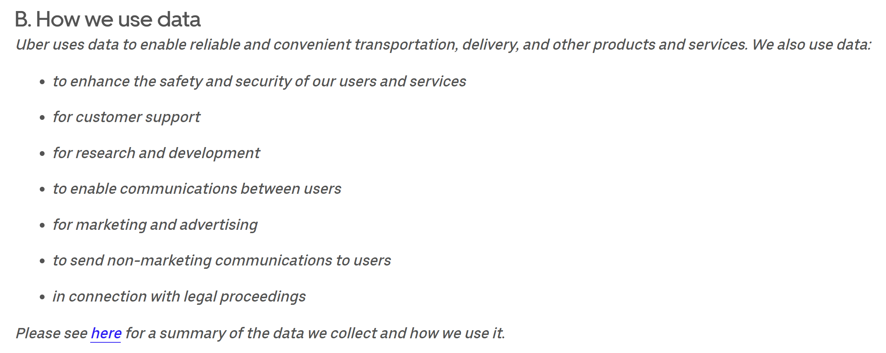
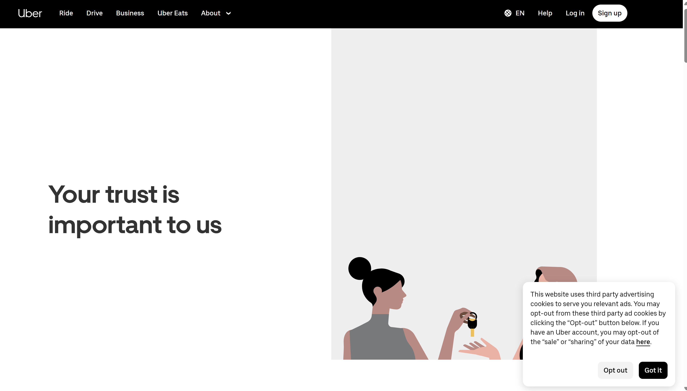
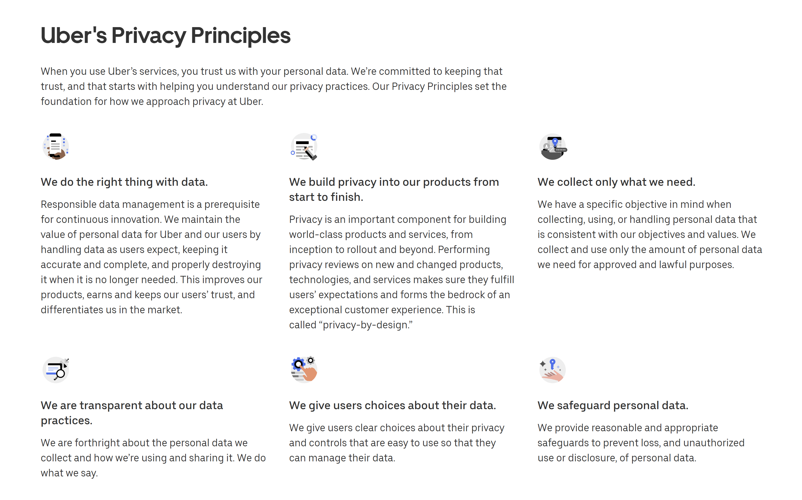
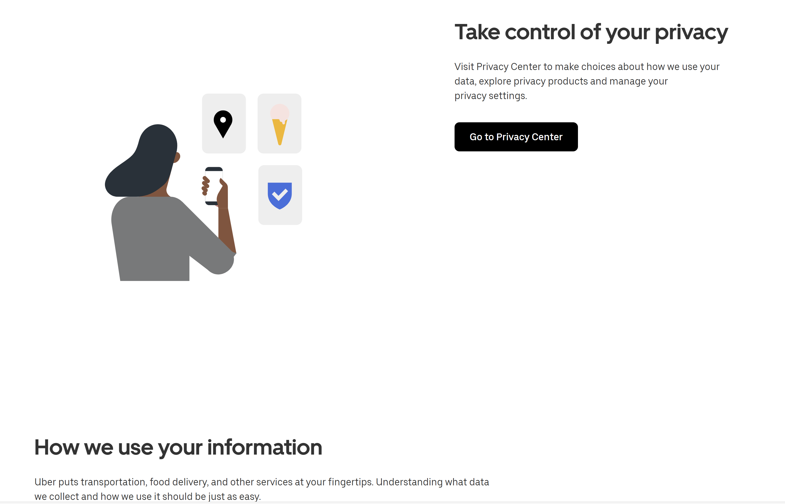
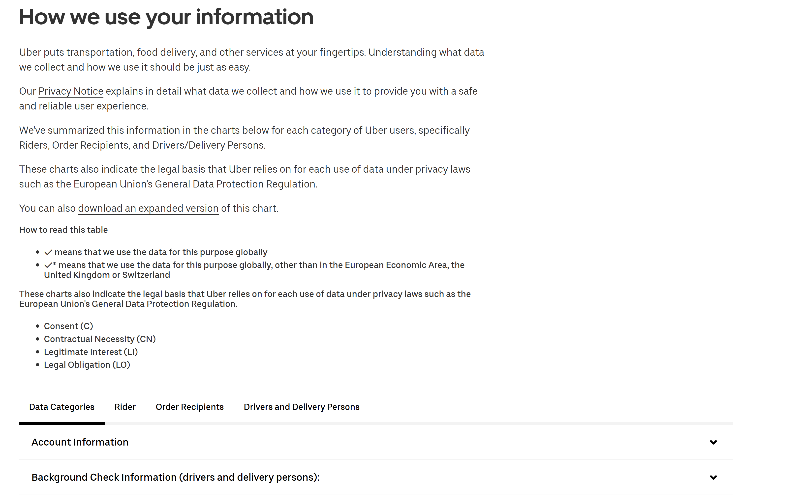

# Uber Case Study

In this UberCaseStudy.md file I'm going to go through all of Uber and Uber Eats' legal documentation. I'm then going to:
- Explain what each section means
- Figure out why they added each section
- Note what is similar for our project
- Find differences between what they have and what we may want

This will all be important at it'll need to implemented into the term project, avoiding any pitfalls a project this complicated could fall into.

# Introduction

When looking at all of Uber's legal documents and how they compare to Fresh n' Clean's, there's significant overlap. To learn more about each document click the link and it'll bring you to both the original document and a brief analysis of what the document is saying in layman's terms.

There are a number of documents that we will absolutely need. These are:
- [The Copyright Policy Notification of Copyright Infringement](PolicyAnalyses/copyrightPolicyNotificationOfCopyrightInfringement.md)
- [The Feedback Policy](PolicyAnalyses/feedback.md)
- [The Firearms Prohibition Policy](PolicyAnalyses/firearmsProhibition.md)
- [The General Community Guidelines](PolicyAnalyses/generalCommunityGuidelines.md)
- [The Third-Party Data Request Guidelines](PolicyAnalyses/guidelinesForThirdPartyDataRequestsAndServiceOfLegalDocuments.md)
- [The Law Enforcement Data Request Guidelines](PolicyAnalyses/guidelinesForUnitedStatesLawEnforcement.md)
- [The Non-Discrimination Policy](PolicyAnalyses/nonDiscriminationPolicy.md)
- [The Privacy Notice](PolicyAnalyses/privacyNotice.md)
- [The Trademark Policy](PolicyAnalyses/trademarkPolicyNotificationofTrademarkInfringement.md)
- [The Unsolicited Idea Submission Policy](PolicyAnalyses/unsolicitedIdeaSubmissionPolicy.md)
- [The User Generated Content Policy](PolicyAnalyses/userGeneratedContentTerms.md)
- [The Zero-Tolerance on Driving While Under the Influence Policy](PolicyAnalyses/zeroTolerancePolicy.md)

There are also documents we may need. These are:
- [The Consumer Delegated Profile Terms](PolicyAnalyses/consumerDelegatedProfileTerms.md)
- [The Consumer Health Data Privacy Policy and Notice](PolicyAnalyses/consumerHealthDataPrivacy.md)
- [The Cookie Notice](PolicyAnalyses/cookieNotice.md)
- [The Emergency Data Sharing Policy](PolicyAnalyses/emergencyDataSharing.md)
- [The Home Currency Printing Policy](PolicyAnalyses/homeCurrencyPrinting.md)
- [The Public Health Guidelines](PolicyAnalyses/publicHealthGuidelines.md)
- [The Referral Program Rules](PolicyAnalyses/referralProgramRules.md)
- [The Teen Account Terms of Use for Parents and Guardians](PolicyAnalyses/teenAccountTermsOfUseForParents.md)
- [The Teen Account Terms of Use for Teens](PolicyAnalyses/teenAccountTermsOfUseForTeen.md)

Finally there are documents we absolutely do not need right now. These are:
- [The California Anti-Sexual Harassment Policy](PolicyAnalyses/californiaAntiSexualHarrassmentPolicy.md)
- [The Candidate Privacy Notice](PolicyAnalyses/candidatePrivacyNotice.md)
- [The Uber Cash Purchase Agreement](PolicyAnalyses/cashPurchaseAgreement.md)
- [The Covid-19 EO For Sick Leave](PolicyAnalyses/covid19EOForSickLeave.md)
- [The Global Advertising Content Policy](PolicyAnalyses/globalAdvertisingContent.md)
- [The Global Advertising Targeting Policy](PolicyAnalyses/globalAdvertisingTargeting.md)
- [The Public Safety Response Portal Privacy Notice](PolicyAnalyses/publicSafetyResponsePortalPrivacyNotes.md)

All of these documents serve different purposes, many of which we will need to recreate at least in part for our project.

# The Main Takeaways

## Uber values it's own legal well being the most.

Uber clearly puts itself first; it's very relevant in almost every single legal document they release. The most nuanced example of this has to be their [User Generated Content Policy](PolicyAnalyses/userGeneratedContentTerms.md), where the Uber legal team tries to absolve Uber of as much responsibility of possible regarding their user generated content (UGC). Uber wants to simaultanousely be able to control and utilize their UGC as much as possible without being responsibile for it if things go south. They can't outright stop people from saying things, as that would violate the 1st amendment, but since they have their own platform they withhold the right to change the UGC as they see fit, and by using Uber's plaforms you give them that right. It very much walks a grey area and is a topic that many platforms have to deal with.

Uber goes out of it's way on many occassions to do similar things, where they permit others to use their service but reserve the right to change it if it violates their policies, rules or guidelines. This can be seen in almost all of their policies in at least some form or another.

## Uber is very conscious of the data it collects.

Uber lovvvvvvves collecting data. They are very open in their [Privacy Notice](PolicyAnalyses/privacyNotice.md) how they collect data for many purposes, including research and devleopment and to generally improve their services. They collect data from everyone that uses their services. Here's the list of all the ways they use their data, straight from their [Privacy Notice](PolicyAnalyses/privacyNotice.md):

That link at the bottom of the page brings you here:

This very long page forces you to scroll a significant amount to get to the actual privacy center, likely dissuading some users from going there. Additionally it's safeguarded by being on a whole different website, further increasing the barrier to entry. Additionally the path to the privacy center is surrounded with text explaining that Uber cares about your well being, which feel disingenuous and further convinces the user that this is not a worthwhile use of their time. They care about what your data can do, and while that can help the users it doesn't necessarily.

These text blobs are also fairly general, and while they aren't lying (they are transparent, only collect what they need etc.) they are stretching the truth. For instance, yes they are transparent - if you're willing to click through 4 different websites to first access the privacy center. They only collect what they need - if you consider data for safety, security, customer support, research and development, communication, marketing, advertising, non-marketing communications, legal procedings and transportation of products and services 'what they need'. Do they need to send data to advertisers so they can create targeted advertisements for instance? They do to make money, but is it really in the consumer's best interest? I'd argue it isn't.

They are very clear, however, that they don't even try and access health related data unless given permission and it's absolutely necessary. This can be seen in the their [Public Health Guidelines](PolicyAnalyses/publicHealthGuidelines.md) and [Emergency Data Sharing Policy](PolicyAnalyses/emergencyDataSharing.md). While this is likely to align with the law, I'm suprised they don't mention it more in their data collection site to forward their message of trust. The fact that they don't mention it leads me to think that they believe they truly are using user data responsibly and there's no need to try and hide portions of their usage.

Overall, Uber is relatively open and honest with it's data collection and doesn't look to be doing anything too malicious with the data. They do collect a lot of data, however, so if more money-hungry corporate leadership comes in, I could see this user-friendly attitude changing.

# Conclusion + Relation to our Project

To move forward with our project, we will have to recreate all of the nessecary documentation mentioned above. This should put us in a good starting spot, and after that we can reevaluate. These documents only cover the 'All' section, and the Uber Eats specific section 'Mobility and Delivery' will likely have more that is useful for us.

In addition, staying aware of what's happening from a legal perspective is clearly important for projects in general so you don't run yourself into a corner. Every project has a unique set of features and contraints, and putting that against the law to make sure you're not breaking it is always something someone should do.

# Citations

- https://www.uber.com/legal/en/#:~:text=Uber%20Legal.%20Here%20you'll%20find%20legal
- https://www.uber.com/global/en/privacy/overview/